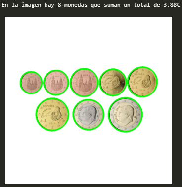
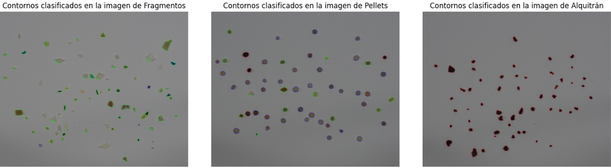
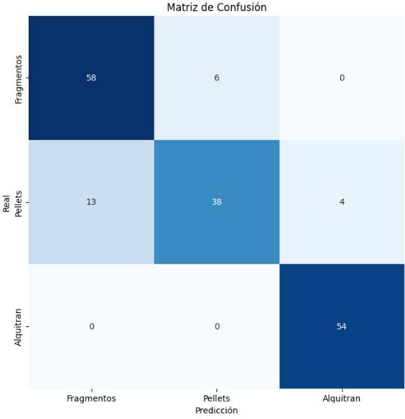

# Práctica 3. Detección y reconocimiento de formas

## Descripción
Detección y reconocimiento de formas en imágenes a partir de umbralizados, detección de contornos y transformada de Hough.

## Tareas del Proyecto
- Determinar la cantidad de monedas (euro) en una imagen.
  


Se realiza un preprocesamiento de la imagen inicial en la que se realiza una conversión de la imagen de BGR a RGB, una conversión de RGB a HSV para la posterior detección de colores, una conversión de RGB a escala de grises y finalmente, a la imagen en escala de grises, se le aplica un desenfoque gaussiano para eliminar posible ruido en la imagen.

Posteriormente se realiza la detección de contornos con la función `cv2.findContours`.

A continuación, se le muestra al usuario una ventana con la imagen para que de clic sobre la moneda de 1 euro y tomarla como referencia para determinar un factor de escala.

Finalmente se realiza la detección de monedas según su radio y su color. De esta forma se puede diferenciar entre monedas muy similares en tamaño, como puede ser las monedas de 50 céntimos y 2 euros o las monedas de 5 céntimos y 10 céntimos.

- Detección y clasificación de las partículas (plástico, pellets y alquitrán) en imágenes de muestras recogidas en playas.
  




## Requisitos
### [Anaconda Prompt](https://www.anaconda.com/)
```
conda create --name VC_P3 python=3.11.5
conda activate VC_P3
```
### OpenCV
```
pip install opencv-python
```
### Matplotlib
```
pip install matplotlib
```
### NumPy
```
pip install numpy
```
### scikit-learn
```
pip install scikit-learn seaborn
```
### ipykernel
```
conda install -n VC_P3 ipykernel --update-deps --force-reinstall
```

## Bibliografía
[OpenCV Contour Features](https://docs.opencv.org/4.x/dd/d49/tutorial_py_contour_features.html)

[Detector de bordes con Canny](https://programarfacil.com/blog/vision-artificial/detector-de-bordes-canny-opencv/)

[Numpy.zeros](https://numpy.org/doc/2.0/reference/generated/numpy.zeros_like.html)


## Autoría
[Sara Expósito Suárez](https://github.com/SaraE5)

[Alejandro Padrón Ossorio](https://github.com/apadoss)
